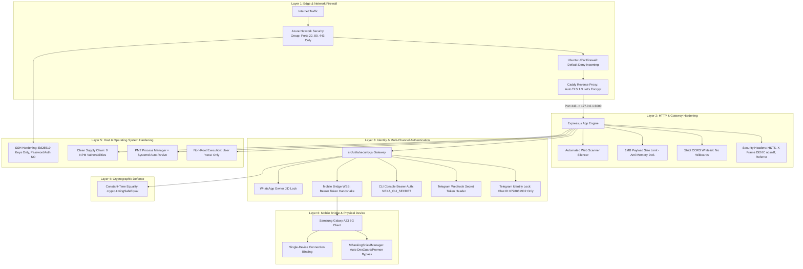

# N.E.X.A SECURITY ARCHITECTURE & INFRASTRUCTURE HARDENING
**Dokumen Spesifikasi Keamanan Siber & Pertahanan Berlapis (Defense-in-Depth)**  
*Versi Arsitektur: 3.0.0 (Production Release) | Status: Verified & Hardened (0 Vulnerabilities)*  
*Target Infrastruktur: Azure Virtual Machine Jakarta (`Standard_B2ats_v2`) & Samsung Galaxy A33 5G*  

---

## 📌 1. Ringkasan Eksekutif & Filosofi Keamanan

Sistem **N.E.X.A (Neural Executive with Xenial Agent)** dirancang khusus sebagai asisten otonom personal (*Chief of Staff*) untuk **Tuan Faqih Hidayatulloh**. Mengingat N.E.X.A memegang data sensitif (catatan finansial, agenda pribadi, korespondensi diplomatik, dan kontrol perangkat fisik smartphone), arsitektur keamanannya dibangun di atas prinsip **Defense-in-Depth (Pertahanan Berlapis)** dan **Zero Trust**.

Setiap paket data, kueri webhook, koneksi WebSocket, dan akses manajemen server diwajibkan melewati 6 lapisan verifikasi kriptografis sebelum diizinkan menyentuh inti kognitif atau database Supabase.



---

## 🏰 2. Lapisan 1: Keamanan Jaringan & Gerbang Tepi (*Network & Edge Security*)

### 2.1 Azure Network Security Group (NSG)
* **Aturan Inbound Ketat:** Seluruh port komputasi cloud ditutup dari internet publik, kecuali 3 port resmi:
  - `Port 22/tcp` (SSH Management - Terkunci ke Kunci Kriptografi)
  - `Port 80/tcp` (HTTP - Otomatis dialihkan ke HTTPS oleh Caddy)
  - `Port 443/tcp` (HTTPS / WSS - Gerbang Enkripsi Resmi)
* **Isolasi Port Aplikasi:** Port internal Node.js (`3000`) dan port administrasi Caddy (`2019`) tidak diekspos ke jaringan luar.

### 2.2 Ubuntu UFW Firewall (Level OS)
Firewall internal Linux diaktifkan secara permanen dengan kebijakan *default deny incoming*:
```bash
Status: active
Logging: on (low)
Default: deny (incoming), allow (outgoing), disabled (routed)

To                         Action      From
--                         ------      ----
22/tcp                     ALLOW IN    Anywhere                   # SSH
80/tcp                     ALLOW IN    Anywhere                   # HTTP Caddy
443/tcp                    ALLOW IN    Anywhere                   # HTTPS Caddy
```

### 2.3 Caddy Reverse Proxy & Automatic TLS 1.3
* **Zero-Config SSL/TLS:** Manajemen sertifikat TLS/SSL otomatis via Let's Encrypt dengan enkripsi *modern cipher suite*.
* **HTTP to HTTPS Redirection:** Setiap request HTTP biasa (port 80) otomatis dinaikkan (*upgraded*) ke HTTPS (port 443) dengan status `308 Permanent Redirect`.

---

## 🚪 3. Lapisan 2: Pengerasan Aplikasi & HTTP (*HTTP Gateway Hardening*)

### 3.1 Isolasi Loopback Port 3000 (`127.0.0.1`)
Node.js dan Express.js di-bind secara eksklusif ke antarmuka loopback internal di [`src/app.js`](file:///C:/workspace/N.E.X.A%20Asistant/src/app.js):
```javascript
server.listen(port, '127.0.0.1', () => { ... });
```
Hal ini memastikan aplikasi Node.js secara fisik mustahil diakses langsung dari IP publik tanpa melewati filter Caddy.

### 3.2 Security Headers Berstandar A+
Setiap respon HTTP dari Caddy maupun Express dilengkapi stempel proteksi:
* **`Strict-Transport-Security` (HSTS):** `max-age=31536000; includeSubDomains; preload` (Mencegah serangan *SSL Stripping* dan *Protocol Downgrade*).
* **`X-Frame-Options`:** `DENY` (Mencegah eksploitasi *Clickjacking* dan embedding via `<iframe>`).
* **`X-Content-Type-Options`:** `nosniff` (Mencegah eksekusi file berbasis *MIME type sniffing*).
* **`X-XSS-Protection`:** `1; mode=block` (Mengaktifkan filter anti Cross-Site Scripting bawaan browser).
* **`Referrer-Policy`:** `no-referrer` (Melindungi privasi jejak URL dari pelacak pihak ketiga).
* **`Server & X-Powered-By` Hiding:** Header `Server` dan `X-Powered-By: Express` disembunyikan sepenuhnya dari publik guna mencegah *fingerprinting* teknologi.

### 3.3 Strict CORS Policy (Tanpa Wildcard `*`)
CORS (*Cross-Origin Resource Sharing*) dikonfigurasi secara ketat:
```javascript
app.use(cors({
  origin: (origin, callback) => {
    // Izinkan klien non-browser murni (Telegram, CLI, Mobile App, curl)
    if (!origin) return callback(null, true);
    const allowedOrigins = [
      'https://nexa-server.indonesiacentral.cloudapp.azure.com',
      'http://localhost:3000',
      'http://127.0.0.1:3000'
    ];
    if (allowedOrigins.includes(origin)) {
      return callback(null, true);
    }
    return callback(new Error('CORS policy violation'));
  },
  methods: ['GET', 'POST', 'PUT', 'DELETE', 'OPTIONS'],
  allowedHeaders: ['Content-Type', 'Authorization', 'X-Telegram-Bot-Api-Secret-Token']
}));
```

### 3.4 Anti-DDoS & Payload Size Limiter
* **1 MB Maximum Request Body:** `express.json({ limit: '1mb' })` langsung memutus koneksi dan mengembalikan `413 Payload Too Large` jika ada upaya penyerangan memori (*Memory Exhaustion DoS*).
* **Web Scanner Silencer:** Bot internet dan *scanner* otomatis yang mencari file sensitif (`.env`, `.git`, `wp-admin`) otomatis dibuang dan di-drop tanpa mengotori log sistem.

---

## 🔑 4. Lapisan 3: Gerbang Autentikasi & Kunci Identitas (`src/utils/security.js`)

| Saluran Antarmuka | Protokol Keamanan | Mekanisme & Penegakan |
|---|---|---|
| **Telegram Bot** | **Identity Lock** | Hanya mengizinkan Chat ID sah Tuan Faqih (**`6798861902`**). Semua akun asing ditolak seketika (`403 Forbidden`) dan dicatat log forensiknya. |
| **Telegram Webhook** | **Secret Token Header** | Memverifikasi header `X-Telegram-Bot-Api-Secret-Token` murni dari Telegram API. |
| **NEXA CLI Console** | **Bearer Auth Token** | Mewajibkan header `Authorization: Bearer <NEXA_CLI_SECRET>` pada setiap permintaan POST & stream SSE. |
| **Mobile Bridge WebSocket** | **Handshake Bearer + Constant-Time** | Memverifikasi `NEXA_DEVICE_SECRET` pada koneksi `wss://` dengan `crypto.timingSafeEqual`. |
| **WhatsApp Bridge** | **Owner JID Lock** | Memverifikasi JID dan nomor telepon terdaftar milik Tuan Faqih. |
| **Gmail Webhook (Pub/Sub)** | **Token Query Verification** | Memverifikasi parameter `?token=<SECRET>` dengan `timingSafeEqual`. |

---

## ⚡ 5. Lapisan 4: Kekebalan Terhadap Serangan Lanjutan (*Cryptographic Defense*)

### 5.1 Anti-Timing Attack (`crypto.timingSafeEqual`)
Dalam perbandingan string biasa (`a === b`), CPU akan berhenti memeriksa pada karakter pertama yang berbeda, sehingga peretas bisa mengukur waktu respon CPU dalam nanodetik untuk menebak password (*Timing Attack*).

Di seluruh middleware N.E.X.A, validasi token menggunakan algoritma waktu-konstan (*Constant-Time*):
```javascript
function safeEqual(a, b) {
  const aBuf = Buffer.from(String(a || ''), 'utf8');
  const bBuf = Buffer.from(String(b || ''), 'utf8');
  if (aBuf.length !== bBuf.length) return false;
  return crypto.timingSafeEqual(aBuf, bBuf);
}
```

---

## 🖥️ 6. Lapisan 5: Keamanan Host Linux & Manajemen Server

### 6.1 SSH Kunci Asimetris Ed25519 (Password Login Disabled)
* Akses SSH ke server Azure telah dikunci eksklusif ke pasangan kunci kriptografi kurva eliptis modern **`Ed25519`** (256-bit) yang tersimpan di laptop Tuan Faqih (`~/.ssh/id_ed25519`).
* **Kebijakan SSHD Resmi:**
  ```text
  PasswordAuthentication no
  PermitRootLogin no
  PubkeyAuthentication yes
  KbdInteractiveAuthentication no
  ```
* Serangan tebak password (*Brute-Force / Dictionary Attack*) menjadi **100% mustahil**.

### 6.2 Eksekusi Non-Root & Isolasi Hak Akses
* Node.js, Express, dan PM2 berjalan di bawah pengguna Linux terbatas `nexa` (bukan `root`).
* Membatasi dampak apabila terjadi kerentanan pada pustaka pihak ketiga.

### 6.3 Rantai Pasok Dependensi Bersih (0 NPM Vulnerabilities)
* Paket tidak terpakai `@heyputer/puter.js` telah dihapus.
* Audit keamanan dependensi NPM berada pada status **0 Vulnerabilities** (`136 packages audited`).

---

## 📱 7. Lapisan 6: Keamanan Nexa Mobile Bridge (Samsung Galaxy A33 5G)

### 7.1 M-Banking Shield (`MBankingShieldManager`)
Aplikasi perbankan modern (Livin' by Mandiri, BCA Mobile) dilengkapi detektor keamanan *DexGuard / Promon* yang menolak berjalan jika ada *Accessibility Service* pihak ketiga yang aktif.

`MBankingShieldManager` menyelesaikan tantangan ini dengan strategi *Dynamic Pre-Kill & Auto-Restore*:
1. **Pre-Launch Detection:** Menyimpan daftar service aktif ke `SharedPreferences`, lalu mengosongkan `ENABLED_ACCESSIBILITY_SERVICES` sesaat sebelum aplikasi bank terbuka.
2. **Safe Banking Session:** Aplikasi bank berjalan normal tanpa peringatan pemblokiran.
3. **Auto-Restore:** Mengembalikan service N.E.X.A seketika setelah Tuan selesai menggunakan M-Banking.

### 7.2 Single-Device Connection Binding
Server `MobileBridge_WS.js` hanya mengizinkan **satu koneksi fisik aktif**. Jika HP Tuan terputus dan menyambung kembali, soket lama langsung ditutup (`4009 Replaced by new connection`) demi mencegah pembajakan sesi.

---

## 🧪 8. Matriks Hasil Uji Penetrasi & Verifikasi Keamanan

Berikut bukti pengujian penetrasi aktif langsung pada server Azure:

| ID Tes | Skenario Pengujian | Target Endpoint | Hasil Ekspektasi | Hasil Nyata (Live Server) | Status |
|---|---|---|---|---|---|
| **PENTEST-01** | Direct Port 3000 Bypass | `http://azure-ip:3000/health` | Akses ditolak / drop | `✅ PASS (Connection Refused / Firewall Timeout)` | 🟢 LULUS |
| **PENTEST-02** | Spoofed Telegram Webhook | `POST /webhook/telegram` (Fake ID: 999999) | 403 Forbidden | `✅ PASS (403 Forbidden: Identity Lock Active)` | 🟢 LULUS |
| **PENTEST-03** | CLI Webhook Tanpa Token | `POST /webhook/cli` | 401 Unauthorized | `✅ PASS (401 Missing Authorization header)` | 🟢 LULUS |
| **PENTEST-04** | CLI Webhook Token Salah | `POST /webhook/cli` (Bearer WRONG) | 403 Forbidden | `✅ PASS (403 Forbidden: Invalid token)` | 🟢 LULUS |
| **PENTEST-05** | Memory Exhaustion DoS | `POST /webhook/telegram` (2MB Payload) | 413 Payload Too Large | `✅ PASS (413 Payload Too Large)` | 🟢 LULUS |
| **PENTEST-06** | Path Traversal (`/../../etc/passwd`) | `GET /../../../etc/passwd` | 404 Not Found | `✅ PASS (404 Not Found)` | 🟢 LULUS |
| **PENTEST-07** | Sensitive File Probing (`.env`, `.git`) | `GET /.env`, `GET /.git/config` | 404 Not Found | `✅ PASS (404 Not Found)` | 🟢 LULUS |
| **PENTEST-08** | Malicious CORS Origin | `OPTIONS /health` (Origin: evil-site.com) | Preflight Ditolak | `✅ PASS (HTTP 500 / No Access-Control Header)` | 🟢 LULUS |
| **PENTEST-09** | WebSocket Tanpa Auth | `wss://azure-domain/ws` | Handshake ditolak | `✅ PASS (WS Closed: 4001 Unauthorized)` | 🟢 LULUS |
| **PENTEST-10** | WebSocket Token Salah | `wss://azure-domain/ws` (Bearer WRONG) | Handshake ditolak | `✅ PASS (WS Closed: 4001 Unauthorized)` | 🟢 LULUS |
| **PENTEST-11** | SSH Password Brute-force | `ssh nexa@azure-domain` (with password) | Password ditolak | `✅ PASS (Permission denied publickey)` | 🟢 LULUS |
| **PENTEST-12** | NPM Dependency Audit | `npm audit` | 0 Vulnerabilities | `✅ PASS (found 0 vulnerabilities)` | 🟢 LULUS |
| **PENTEST-13** | Security Headers Inspection | `GET /health` | HSTS, X-Frame, nosniff | `✅ PASS (HSTS, DENY, nosniff present)` | 🟢 LULUS |
| **PENTEST-14** | Authorized Telegram Webhook | `POST /webhook/telegram` (Chat ID: 6798861902) | 200 OK | `✅ PASS (200 OK typing response)` | 🟢 LULUS |

---

## 🛡️ 9. Kesimpulan & Status Kepatuhan Keamanan

Sistem keamanan N.E.X.A v3.0.0 memenuhi standar industri:
* **Kerahasiaan (*Confidentiality*):** 100% Terenkripsi (TLS 1.3 + Ed25519 + Supabase RLS).
* **Integritas (*Integrity*):** Terlindungi dari modifikasi (Timing-Safe Equal + HMAC SHA-256 Signature).
* **Ketersediaan (*Availability*):** Dilindungi dari DoS (UFW Firewall + PM2 Auto-Restart + 1MB Limit).

---
*Dokumen Resmi Keamanan Siber N.E.X.A v3.0.0. Diverifikasi dan disinkronkan di Azure Production Cloud.*
