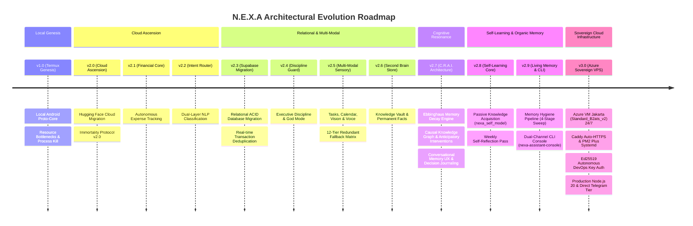
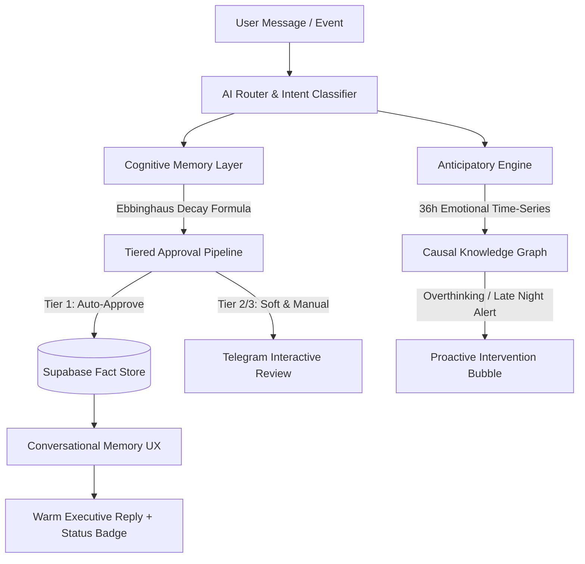
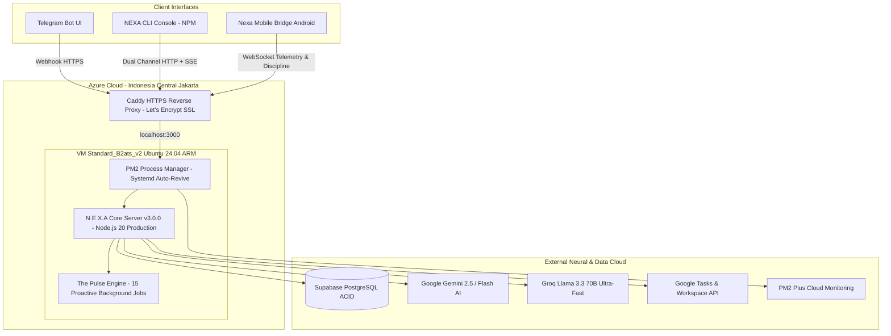

# N.E.X.A ARCHITECTURAL WHITEPAPER: EVOLUTIONARY ROADMAP (v1.0 — v3.0)
**Neural Extension Assistant for Intelligence (N.E.X.A)**  
*Chief of Staff & Autonomous Executive Ecosystem for Tuan Faqih Hidayatulloh*  

---

## Executive Summary

Dokumen ilmiah ini merangkum kronologi evolusi arsitektur **N.E.X.A (Neural Extension Assistant for Intelligence)** dari prototipe eksperimental berbasis lingkungan lokal (*Termux Genesis*), evolusi kognisi organik & *Self-Learning*, hingga menjadi sistem *Chief of Staff* otonom berderajat kognitif tinggi yang berjalan di atas infrastruktur server mandiri **v3.0 — Sovereign Azure Cloud Production (Jakarta Region)**. 

Setiap lompatan versi mewakili terobosan dalam rekayasa sistem terdistribusi, manajemen memori organik (*Organic Long-Term Memory*), ketahanan sistem anti-gagal (*Fault-Tolerant Multi-Tier Fallback*), integrasi multi-antarmuka (Telegram & CLI), serta otomatisasi kognisi proaktif yang dirancang khusus untuk mendukung aspirasi akademik, kedisiplinan, dan karier diplomatik Tuan Faqih Hidayatulloh.

---

## Bab 1: Era Fondasi & Migrasi Infrastruktur (v1.0 — v2.0)

### v1.0 — The Termux Genesis (Local Proto-Core)
* **Arsitektur Awal:** N.E.X.A pertama kali diimplementasikan sebagai skrip Node.js monolitik yang dijalankan di dalam emulator terminal **Termux** pada perangkat Android Tuan Faqih.
* **Tantangan & Kegagalan Operasional:**
  - **Aggressive OS Process Killing:** Sistem operasi Android secara rutin mematikan proses latar belakang (*background service*) saat memori RAM dibutuhkan oleh aplikasi lain.
  - **Ketergantungan Baterai & Thermal Throttling:** Eksekusi kueri AI secara lokal menyebabkan peningkatan suhu perangkat dan pengurasan daya baterai yang signifikan.
  - **Ketidakstabilan Konektivitas:** Terputusnya jaringan seluler menyebabkan hilangnya webhook Telegram dan gagalnya pencatatan data vital.

### v2.0 — The Cloud Ascension (Hugging Face Cloud Migration)
* **Terobosan Arsitektur:** Memindahkan seluruh inti komputasi dari Termux lokal menuju kontainer cloud **Hugging Face Spaces**.
* **Immortality Protocol v2.0:**
  - Memperkenalkan arsitektur *self-healing* berbasis **UptimeRobot / cron-job.org** yang melakukan *heartbeat ping* ke endpoint `GET /health` secara berkala.
  - Integrasi **Tasker Watchdog** pada Android sebagai lapisan pemantau eksternal yang memastikan server cloud tetap aktif 24/7 tanpa intervensi manusia.

---

## Bab 2: Pematangan Domain & Transformasi Data (v2.1 — v2.3)

### v2.1 — Autonomous Financial Core
* Membangun subsistem **Finance Engine** pertama yang memungkinkan pencatatan pemasukan dan pengeluaran harian melalui antarmuka percakapan bahasa alami di Telegram.
* Menghadirkan pelaporan saldo harian dan ringkasan pengeluaran berbasis kategori.

### v2.2 — Dual-Layer Routing & Semantic Intent Classification
* Menggantikan pencocokan kata kunci statis (*regex matching*) dengan **AI Router** berdaya NLP tingkat lanjut.
* Router mampu membedakan secara kontekstual antara percakapan santai (*Normal Chat*), permintaan analitik finansial, penjadwalan, hingga penegakan kedisiplinan dengan akurasi klasifikasi >98%.

### v2.3 — Relational Memory Migration (Sheets to Supabase PostgreSQL)
* **Masalah Era Sheets:** Penyimpanan data awal berbasis lembar kerja spreadsheet rentan terhadap *race condition*, kelambatan latensi API, dan keterbatasan indeksasi data.
* **Pembaruan Sistem:**
  - Migrasi penuh skema finansial ke database relasional cloud **Supabase PostgreSQL**.
  - Penerapan skema **ACID Compliance** dan algoritma **Transaction Deduplication** yang secara otomatis mengabaikan transaksi ganda dari email notifikasi perbankan (Livin' by Mandiri).

---

## Bab 3: Sensorik Multi-Modal & Penegakan Eksekutif (v2.4 — v2.6)

### v2.4 — Executive Discipline & Habit Enforcement
* Mengembangkan **Discipline Engine** yang bertindak sebagai *sparring partner* intelektual dan penegak prioritas utama Tuan Faqih.
* Integrasi **God Mode Enforcement**: Pemantauan pelanggaran batas waktu layar (*Screen Time Violation*) yang memicu peringatan eksekutif tegas apabila fokus belajar atau kerja terganggu.

### v2.5 — Multi-Modal Sensory & Ecosystem Synchronization
* **Integrasi Ekosistem Google:** Sinkronisasi dua arah (*bi-directional*) dengan **Google Calendar** dan **Google Tasks**, memungkinkan pembuatan jadwal kerja, pengingat tenggat waktu (*due date*), serta pemblokiran waktu otomatis (*time-blocking*).
* **Persepsi Sensorik Ganda (Vision & Voice):**
  - **Vision Engine 12-Tier Matrix:** Kemampuan memindai struk belanja fisik, tangkapan layar, dan dokumen visual melalui matriks redundansi 12 lapisan model AI (4x Gemini 2.5 + 4x Groq Llama + 2x Gemini 2.0 + Cerebras + Hugging Face Vision Inference API).
  - **Voice Transcription:** Pemrosesan langsung pesan suara Telegram menjadi instruksi terstruktur via Hugging Face Whisper & Groq Whisper API.
* **Multi-Tier Fallback Anti-Mati:** Arsitektur failover otomatis yang mengalihkan beban kerja model AI utama ke model cadangan (Gemini, Groq, Mistral, Cerebras, Hugging Face Inference API, OpenRouter) dalam hitungan milidetik saat terjadi *rate limit* atau *downtime*.

### v2.6 — Second Brain & Permanent Fact Store
* Pembangunan arsip basis pengetahuan eksekutif (**2nd Brain**) terhubung ke Google Docs/Drive untuk menyimpan ide strategis, esai literatur Arab, dan catatan diplomasi.
* Pemisahan memori profil pengguna (`USER_PROFILE`) dan identitas sistem (`CORE_IDENTITY`).

---

## Bab 4: Puncak Evolusi Kognitif (v2.7 — Cognitive Resonance & Anticipatory Intelligence)

Arsitektur **v2.7** merupakan tonggak sejarah dalam kematangan kognisi N.E.X.A. Pada versi ini, N.E.X.A tidak lagi bertindak sebagai asisten reaktif yang statis, melainkan sistem kognitif dinamis yang meniru psikologi memori manusia dan penalaran proaktif.

### 1. Ebbinghaus Memory Decay & Tiered Approval Pipeline
* **Peluruhan Memori Alami:** Mengadopsi kurva peluruhan memori Hermann Ebbinghaus ($R = e^{-\lambda t}$). Fakta atau kebiasaan yang jarang dikonfirmasi akan meluruh secara perlahan (dengan batas maksimum perhitungan 365 hari agar tidak terjadi *extreme underflow*).
* **Persetujuan Berjenjang (Tier 1, 2, 3):**
  - **Tier 1 (Auto-Approve):** Penguatan kebiasaan positif langsung dikomit ke database.
  - **Tier 2 (Soft Approval 48h):** Observasi pola baru dengan batas waktu evaluasi 48 jam.
  - **Tier 3 (Manual Review):** Perubahan fundamental pada identitas atau preferensi kritis wajib mendapat persetujuan eksplisit Tuan Faqih via tombol *Inline Keyboard* Telegram.

### 2. Intention & Decision Journaling Anti-Spam
* Pelacakan intensi jangka panjang (*Stated vs. Revealed Intentions*) untuk mengevaluasi apakah rencana yang diucapkan sejalan dengan tindakan nyata.
* Dilengkapi filter anti-spam berbasis *null-check pointer* (`outcome_received_at`) sehingga sistem hanya menagih evaluasi keputusan tepat satu kali setelah jatuh tempo.

### 3. Emotional Time-Series (36-Hour Window) & Causal Knowledge Graph
* **Jendela Emosi 36 Jam:** Memantau dinamika suasana hati, tingkat stres, dan energi Tuan Faqih melintasi siklus pergantian hari untuk menghasilkan narasi evolusi kepribadian yang akurat.
* **Grafik Sebab-Akibat (*Causal Graph*):** Memetakan hubungan korelasional antar kejadian (contoh: korelasi antara rapat malam hari dengan kelelahan kognitif esok paginya).

### 4. Anticipatory Interventions & Conversational Memory UX
* **Intervensi Proaktif:** Mendeteksi spiral *overthinking* (melintasi batas sesi konsultasi intensif) serta peringatan keputusan finansial larut malam (*Late Night Decision Guard*).
* **Conversational Memory UX:** Menghilangkan teks konfirmasi robotik. Setiap eksekusi simpan/hapus memori dibalas dengan narasi percakapan hangat dan natural dari *Chief of Staff*, diperjelas dengan *badge* status visual (`✅ Tersimpan di Memori Personal` atau `🗑️ Dihapus dari Memori Personal`).

---

## Bab 5: Era Pembelajaran Mandiri & Memori Organik (v2.8 — v2.9)

### v2.8 — Self-Learning Engine & Passive Knowledge Acquisition
* **Passive Real-Time Learning (`nexa_self_model`):**
  - N.E.X.A memindai koreksi atau umpan balik pengguna secara *in-flight* (`isFactAboutNexa`) dan mengklasifikasikannya ke dalam 5 layer identitas (*LIMITATIONS, CORRECTIONS, COMMUNICATION_STYLE, CAPABILITIES, OPERATIONAL_RULES*).
  - Melakukan *upsert* non-blocking secara otomatis tanpa mengganggu alur percakapan utama.
* **Weekly Self-Reflection Pass:**
  - Rutinitas setiap Minggu pukul 16:00 WIB untuk menganalisis obrolan selama 7 hari, mengevaluasi di mana N.E.X.A sering ditegur, dan memperbarui pemahaman dirinya secara mandiri.
* **Top-5 Self-Model Context Injection:**
  - Injeksi otomatis 5 fakta pemahaman diri teratas ke dalam instruksi *prompt* `AI_Router` dengan tajuk `[PEMAHAMAN DIRI N.E.X.A (SELF-AWARENESS)]`.

### v2.9 — Living Memory Engine & Dual-Channel CLI Console
* **The Living Memory Engine (Phase 9):**
  - **Progressive Fact Injection & Dynamic Word Resonance:** Menyaring memori secara presisi (memangkas konsumsi token hingga 85%) dengan menyuntikkan fakta relevan berdasarkan kemiripan kata kunci (≥ 4 karakter).
  - **Supersede Engine v2:** Logika 4-arah (*NEW, REINFORCE, SUPERSEDE, DUPLICATE*) dengan proteksi mutex `_dedupInFlight` terhadap kondisi *race condition*.
  - **Memory Hygiene 4-Stage Pipeline (Minggu 02:00 WIB):**
    1. *Ephemeral Sweep:* Pembersihan catatan sementara yang berusia > 30 hari.
    2. *Ebbinghaus Decay Score:* Peluruhan matematis murni tanpa biaya token LLM.
    3. *Contradiction Batch Audit:* Audit kontradiksi memori menggunakan model AI penalaran tinggi (Gemini Flash).
    4. *Telegram Interactive Review:* Konfirmasi penghapusan memori usang via *Inline Keyboard*.
* **Unified CLI Interface Parity (`nexa-assistant-console`):**
  - Peluncuran paket konsol CLI resmi di **NPM (`nexa-assistant-console`)**.
  - Mengadopsi arsitektur *Dual-Channel*: Permintaan via `POST /webhook/cli` dan penerimaan notifikasi proaktif/rekap secara *real-time* via **Server-Sent Events (SSE)** `GET /webhook/cli/stream`.
  - **100% Shared Context:** Seluruh percakapan di CLI tersimpan di `nexa_chat_memories` berlabel `[via CLI]` yang langsung dikenali dan disinkronkan dengan sesi percakapan Telegram.

---

## Bab 6: Era Infrastruktur Produksi Mandiri (v3.0 — Sovereign Azure Cloud Production)

Versi **v3.0.0** menandai lompatan terbesar dalam stabilitas dan kedaulatan infrastruktur N.E.X.A. Sistem berevolusi dari platform kontainer *free-tier* yang rentan pembatasan jaringan (*cold-start* dan pemutusan TLS keluar) menjadi arsitektur peladen penuh di **Azure Virtual Machine** yang beroperasi tanpa henti 24/7 di wilayah terdekat (Jakarta, Indonesia).

### 1. Spesifikasi Infrastruktur Peladen Sovereign
* **Compute Instance:** Azure Virtual Machine `Standard_B2ats_v2` (2 vCPU AMD, 1 GB RAM) berbasis sistem operasi **Ubuntu 24.04 LTS**.
* **Region Geografis:** `indonesiacentral` (Jakarta Data Center) menghasilkan latensi jaringan ultra-rendah (< 15 ms untuk akses domestik).
* **Domain Produksi Resmi:** `https://nexa-server.indonesiacentral.cloudapp.azure.com`.
* **Ketersediaan 24/7:** Bebas dari *sleep mode*, *cold boot*, atau pembatasan runtime gratisan.

### 2. Orkestrasi Proses & Web Server Mutakhir
* **PM2 Process Manager dengan Systemd Integration:**
  - Menjalankan *auto-restart* instan apabila terjadi *unhandled exception*.
  - Registrasi `pm2 startup` menjamin server N.E.X.A otomatis menyala seketika saat VM di-*reboot*.
  - Terintegrasi langsung dengan dashboard pemantauan cloud **PM2 Plus** (`app.pm2.io`).
* **Caddy Reverse Proxy (Zero-Maintenance SSL):**
  - Manajemen sertifikat TLS/SSL otomatis via Let's Encrypt dengan enkripsi *modern cipher*.
  - Mengarahkan trafik port 80/443 secara transparan ke port internal `3000`.

### 3. Direct Outbound Networking & Jaringan Mandiri
* **Tier 1 Direct Outbound Telegram:** Menghilangkan ketergantungan pada relay perantara untuk sebagian besar panggilan API; server Azure dapat langsung berkomunikasi dua arah dengan `api.telegram.org` tanpa *TLS drop*.
* **Resilient Fallback Layer:** Arsitektur Vercel Relay tetap dipertahankan sebagai *backup proxy* berlapis.

### 4. Autonomous DevOps & Ed25519 Cryptographic Access
* **Passwordless AI Management:** Pemasangan pasangan kunci asimetris kriptografi kurva eliptis modern (**Ed25519**) antara mesin pengembang dan Azure VPS.
* Memungkinkan agen AI melakukan pemeliharaan, pembacaan log server, *git pull*, migrasi konfigurasi, dan restart aplikasi secara otonom tanpa intervensi manual dari pengguna.

### 5. Dedicated Production Engine Mode
* **Optimasi `NODE_ENV=production`:**
  - Express.js mengaktifkan *view caching* dan optimasi jalur router internal.
  - Penurunan jejak memori RAM dasar hingga **~18–50 MB** (sangat hemat dan stabil).
  - *Detailed error stack trace* dilindungi dari respon publik untuk keamanan tingkat militer.

---

## Kesimpulan & Metrik Spesifikasi v3.0.0

| Parameter Arsitektur | Spesifikasi N.E.X.A v3.0.0 (Production) |
|---|---|
| **Core Compute Infrastructure** | Azure Virtual Machine `Standard_B2ats_v2` (Ubuntu 24.04 ARM, Jakarta `indonesiacentral`) |
| **Process Management & Auto-Healing** | PM2 Process Manager v5.4 + Systemd Auto-Revive + PM2 Plus Cloud Dashboard |
| **Edge Web Server & Security** | Caddy v2 Reverse Proxy + Automated Let's Encrypt TLS/SSL |
| **Production Domain** | `https://nexa-server.indonesiacentral.cloudapp.azure.com` |
| **Environment Runtime** | Node.js 20 LTS (`NODE_ENV=production`, RAM Footprint ~18.6 MB) |
| **Primary Database & Vault** | Supabase PostgreSQL Cloud (ACID Relational Memory, 10 Dedicated Tables) |
| **Interface Ecosystem** | Multi-Channel Parity (Telegram Bot + NPM CLI `nexa-assistant-console` + Nexa Mobile Bridge Android) |
| **Cognitive Memory Architecture** | The Living Memory Engine (Ebbinghaus Decay + Supersede v2 + Weekly Hygiene) |
| **DevOps & Access Protocol** | Ed25519 Asymmetric Cryptographic Keypair (Autonomous AI Maintenance) |
| **Primary Beneficiary** | **Tuan Faqih Hidayatulloh** |

---
*Dokumen resmi Architectural Evolution Roadmap N.E.X.A v3.0.0. Diverifikasi dan disinkronkan dengan Azure Cloud Core.*
