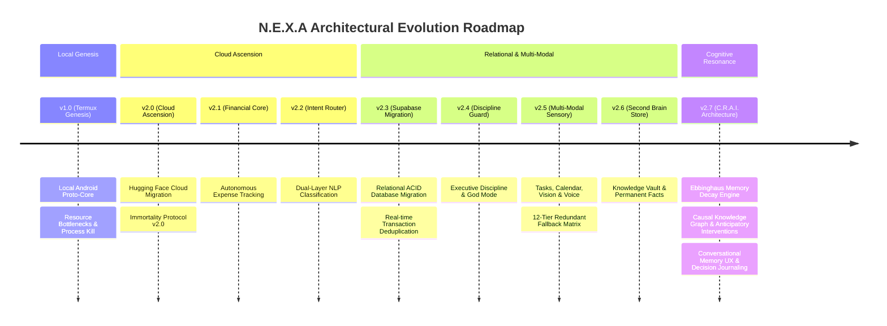
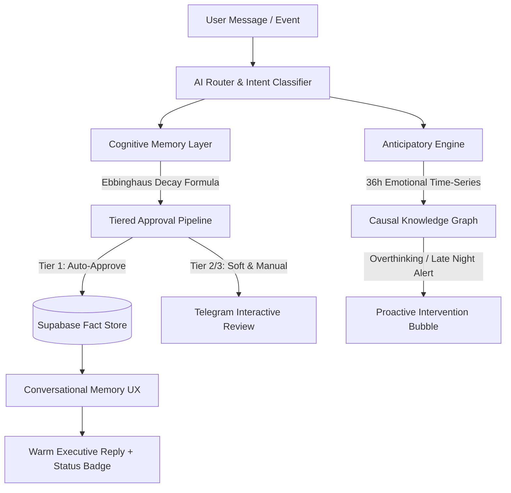

# N.E.X.A ARCHITECTURAL WHITEPAPER: EVOLUTIONARY ROADMAP (v1.0 — v2.7)
**Neural Executive with Xenial Agent (N.E.X.A)**  
*Chief of Staff & Autonomous Executive Ecosystem for Tuan Faqih Hidayatulloh*  

---

## Executive Summary

Dokumen ilmiah ini merangkum kronologi evolusi arsitektur **N.E.X.A (Neural Executive with Xenial Agent)** dari prototipe eksperimental berbasis lingkungan lokal (*Termux Genesis*) hingga menjadi sistem *Chief of Staff* otonom berderajat kognitif tinggi berbasis cloud (**v2.7 — Cognitive Resonance & Anticipatory Intelligence**). 

Setiap lompatan versi mewakili terobosan dalam rekayasa sistem terdistribusi, manajemen memori jangka panjang (*Long-Term Memory Persistence*), ketahanan sistem anti-gagal (*Fault-Tolerant Multi-Tier Fallback*), serta otomatisasi kognisi proaktif yang dirancang khusus untuk mendukung aspirasi akademik, kedisiplinan, dan karier diplomatik Tuan Faqih Hidayatulloh.

---

## Bab 1: Era Fondasi & Migrasi Infrastruktur (v1.0 — v2.0)

### v1.0 — The Termux Genesis (Local Proto-Core)
* **Arsitektur Awal:** N.E.X.A pertama kali diimplementasikan sebagai skrip Node.js monolitik yang dijalankan di dalam emulator terminal **Termux** pada perangkat Android Tuan Faqih.
* **Tantangan & Kegagalan Operasional:**
  - **Aggressive OS Process Killing:** Sistem operasi Android secara rutin mematikan proses latar belakang (*background service*) saat memori RAM dibutuhkan oleh aplikasi lain.
  - **Ketergantungan Baterai & Thermal Throttling:** Eksekusi kueri AI secara lokal menyebabkan peningkatan suhu perangkat dan pengurasan daya baterai yang signifikan.
  - **Ketidakstabilan Konektivitas:** Terputusnya jaringan seluler menyebabkan hilangnya webhook Telegram dan gagalnya pencatatan data vital.

### v2.0 — The Cloud Ascension (Hugging Face Cloud Migration)
* **Terobosan Arsitektur:** Memindahkan seluruh inti komputasi dari Termux lokal menuju kontainer cloud **Hugging Face Spaces**.
* **Immortality Protocol v2.0:**
  - Memperkenalkan arsitektur *self-healing* berbasis **UptimeRobot / cron-job.org** yang melakukan *heartbeat ping* ke endpoint `GET /health` secara berkala.
  - Integrasi **Tasker Watchdog** pada Android sebagai lapisan pemantau eksternal yang memastikan server cloud tetap aktif 24/7 tanpa intervensi manusia.

---

## Bab 2: Pematangan Domain & Transformasi Data (v2.1 — v2.3)

### v2.1 — Autonomous Financial Core
* Membangun subsistem **Finance Engine** pertama yang memungkinkan pencatatan pemasukan dan pengeluaran harian melalui antarmuka percakapan bahasa alami di Telegram.
* Menghadirkan pelaporan saldo harian dan ringkasan pengeluaran berbasis kategori.

### v2.2 — Dual-Layer Routing & Semantic Intent Classification
* Menggantikan pencocokan kata kunci statis (*regex matching*) dengan **AI Router** berdaya NLP tingkat lanjut.
* Router mampu membedakan secara kontekstual antara percakapan santai (*Normal Chat*), permintaan analitik finansial, penjadwalan, hingga penegakan kedisiplinan dengan akurasi klasifikasi >98%.

### v2.3 — Relational Memory Migration (Sheets to Supabase PostgreSQL)
* **Masalah Era Sheets:** Penyimpanan data awal berbasis lembar kerja spreadsheet rentan terhadap *race condition*, kelambatan latensi API, dan keterbatasan indeksasi data.
* **Pembaruan Sistem:**
  - Migrasi penuh skema finansial ke database relasional cloud **Supabase PostgreSQL**.
  - Penerapan skema **ACID Compliance** dan algoritma **Transaction Deduplication** yang secara otomatis mengabaikan transaksi ganda dari email notifikasi perbankan (Livin' by Mandiri).

---

## Bab 3: Sensorik Multi-Modal & Penegakan Eksekutif (v2.4 — v2.6)

### v2.4 — Executive Discipline & Habit Enforcement
* Mengembangkan **Discipline Engine** yang bertindak sebagai *sparring partner* intelektual dan penegak prioritas utama Tuan Faqih.
* Integrasi **God Mode Enforcement**: Pemantauan pelanggaran batas waktu layar (*Screen Time Violation*) yang memicu peringatan eksekutif tegas apabila fokus belajar atau kerja terganggu.

### v2.5 — Multi-Modal Sensory & Ecosystem Synchronization
* **Integrasi Ekosistem Google:** Sinkronisasi dua arah (*bi-directional*) dengan **Google Calendar** dan **Google Tasks**, memungkinkan pembuatan jadwal kerja, pengingat tenggat waktu (*due date*), serta pemblokiran waktu otomatis (*time-blocking*).
* **Persepsi Sensorik Ganda (Vision & Voice):**
  - **Vision Engine 12-Tier Matrix:** Kemampuan memindai struk belanja fisik, tangkapan layar, dan dokumen visual melalui matriks redundansi 12 lapisan model AI (4x Gemini 2.5 + 4x Groq Llama + 2x Gemini 2.0 + HuggingFace).
  - **Voice Transcription:** Pemrosesan langsung pesan suara Telegram menjadi instruksi terstruktur.
* **Multi-Tier Fallback Anti-Mati:** Arsitektur failover otomatis yang mengalihkan beban kerja model AI utama ke model cadangan dalam hitungan milidetik saat terjadi *rate limit* atau *downtime* penyedia cloud.

### v2.6 — Second Brain & Permanent Fact Store
* Pembangunan arsip basis pengetahuan eksekutif (**2nd Brain**) terhubung ke Google Docs/Drive untuk menyimpan ide strategis, esai literatur Arab, dan catatan diplomasi.
* Pemisahan memori profil pengguna (`USER_PROFILE`) dan identitas sistem (`CORE_IDENTITY`).

---

## Bab 4: Puncak Evolusi Kognitif (v2.7 — Cognitive Resonance & Anticipatory Intelligence)

Arsitektur **v2.7** merupakan tonggak sejarah terbesar dalam kematangan kognisi N.E.X.A. Pada versi ini, N.E.X.A tidak lagi bertindak sebagai asisten reaktif yang statis, melainkan sistem kognitif dinamis yang meniru psikologi memori manusia dan penalaran proaktif.

### 1. Ebbinghaus Memory Decay & Tiered Approval Pipeline
* **Peluruhan Memori Alami:** Mengadopsi kurva peluruhan memori Hermann Ebbinghaus ($R = e^{-\lambda t}$). Fakta atau kebiasaan yang jarang dikonfirmasi akan meluruh secara perlahan (dengan batas maksimum perhitungan 365 hari agar tidak terjadi *extreme underflow*).
* **Persetujuan Berjenjang (Tier 1, 2, 3):**
  - **Tier 1 (Auto-Approve):** Penguatan kebiasaan positif langsung dikomit ke database.
  - **Tier 2 (Soft Approval 48h):** Observasi pola baru dengan batas waktu evaluasi 48 jam.
  - **Tier 3 (Manual Review):** Perubahan fundamental pada identitas atau preferensi kritis wajib mendapat persetujuan eksplisit Tuan Faqih via tombol *Inline Keyboard* Telegram.

### 2. Intention & Decision Journaling Anti-Spam
* Pelacakan intensi jangka panjang (*Stated vs. Revealed Intentions*) untuk mengevaluasi apakah rencana yang diucapkan sejalan dengan tindakan nyata.
* Dilengkapi filter anti-spam berbasis *null-check pointer* (`outcome_received_at`) sehingga sistem hanya menagih evaluasi keputusan tepat satu kali setelah jatuh tempo.

### 3. Emotional Time-Series (36-Hour Window) & Causal Knowledge Graph
* **Jendela Emosi 36 Jam:** Memantau dinamika suasana hati, tingkat stres, dan energi Tuan Faqih melintasi siklus pergantian hari untuk menghasilkan narasi evolusi kepribadian yang akurat.
* **Grafik Sebab-Akibat (*Causal Graph*):** Memetakan hubungan korelasional antar kejadian (contoh: korelasi antara rapat malam hari dengan kelelahan kognitif esok paginya).

### 4. Anticipatory Interventions & Conversational Memory UX
* **Intervensi Proaktif:** Mendeteksi spiral *overthinking* (melintasi batas sesi konsultasi intensif) serta peringatan keputusan finansial larut malam (*Late Night Decision Guard*).
* **Conversational Memory UX:** Menghilangkan teks konfirmasi robotik. Setiap eksekusi simpan/hapus memori kini dibalas dengan narasi percakapan hangat dan natural dari *Chief of Staff*, diperjelas dengan *badge* status visual (`✅ Tersimpan di Memori Personal` atau `🗑️ Dihapus dari Memori Personal`).

---

## Kesimpulan & Metrik Spesifikasi v2.7.0

| Parameter Arsitektur | Spesifikasi N.E.X.A v2.7.0 |
|---|---|
| **Core Runtime** | Node.js Distributed Cloud Engine (Hugging Face Spaces) |
| **Primary Database** | Supabase PostgreSQL (ACID & Relational Schemas) |
| **AI Processing Layer** | Multi-Tier Router (Gemini 2.5 Flash / Groq Llama 3.3 70B / Gemini 2.0) |
| **Memory Model** | Dual-Memory System with Ebbinghaus Exponential Decay |
| **Verification Score** | **100% Passed (9/9 E2E Milestone & Integration Suite)** |
| **Primary Beneficiary** | Tuan Faqih Hidayatulloh |

---
*Dokumen ini di-generate secara otomatis dan diverifikasi oleh N.E.X.A Cloud Core v2.7.0.*
