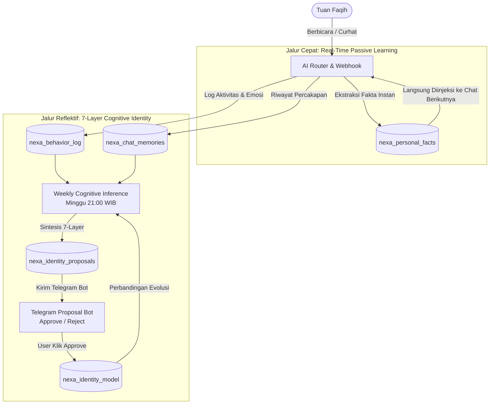

# 🧠 ARSITEKTUR MEMORI GANDA & KOGNITIF EVOLUSIONER N.E.X.A (PHASE 6)

Dokumen ini menjelaskan secara spesifik dan mendalam mengenai arsitektur **Dual-Memory System** (Sistem Memori Ganda), pencatatan perilaku (*Behavioral Tracking*), serta siklus inferensi kepribadian mingguan (*Weekly Cognitive Identity Inference*) yang menjadi inti kesadaran N.E.X.A sebagai asisten eksekutif pribadi **Tuan Faqih Hidayatulloh**.

---

## 1. Filosofi Arsitektur Memori Ganda (*Dual-Memory System*)

N.E.X.A memisahkan ingatan menjadi dua jalur pemrosesan agar memiliki **respon instan saat percakapan** namun tetap **stabil dan tidak impulsif dalam memahami kepribadian mendalam user**.



### A. Jalur Cepat — *Real-Time Passive Learning* (`nexa_personal_facts`)
* **Waktu Pemrosesan:** Instan (Detik itu juga saat pesan diproses).
* **Tujuan:** Menyerap fakta konkret tentang user atau sistem agar obrolan berikutnya langsung kontekstual.
* **Mekanisme:**
  1. `routeUserMessage` mendeteksi adanya fakta baru pada field JSON `learned_user_facts` atau `learned_core_identities`.
  2. Fungsi `deduplicateAndSaveFact()` menyimpan fakta ke tabel `nexa_personal_facts` (atau `nexa_core_identity`).
  3. Cache memori RAM (`_personalFactsCache`) langsung di-reset sehingga pesan berikutnya 100% sadar akan fakta baru ini.

### B. Jalur Reflektif — *7-Layer Cognitive Identity Model* (`nexa_identity_model`)
* **Waktu Pemrosesan:** Mingguan (Setiap Minggu pukul 21:00 WIB) atau atas persetujuan eksplisit.
* **Tujuan:** Membangun profil psikologis eksekutif 7 lapisan yang mendalam dan berjangka panjang.
* **Mengapa Tidak Real-Time?** Agar model kepribadian user tidak berubah-ubah/kacau hanya karena emosi sesaat atau satu obrolan impulsif.

---

## 2. 7 Lapisan Kepribadian Kognitif (*7-Layer Cognitive Model*)

Sistem mengklasifikasikan pemahamannya atas Tuan Faqih ke dalam 7 lapisan psikologis:

| Layer | Nama Lapisan | Deskripsi & Contoh |
| :--- | :--- | :--- |
| **1** | `FACTS` | Realitas hidup, studi, dan pekerjaan (misal: *Mahasiswa, tinggal di Jakarta*). |
| **2** | `PREFERENCES` | Preferensi komunikasi & interaksi (misal: *Suka jawaban langsung ke inti tanpa basa-basi*). |
| **3** | `HABITS` | Ritme & kebiasaan harian (misal: *Rutinitas evaluasi malam paling efektif pukul 21:00 WIB*). |
| **4** | `VALUES` | Nilai & prinsip fundamental (misal: *Menjaga efisiensi pengeluaran dan disiplin target*). |
| **5** | `DECISION_STYLE` | Cara merespons tekanan atau pilihan (misal: *Cenderung analitis saat memutuskan pengeluaran besar*). |
| **6** | `WEAKNESSES` | Hambatan internal / tantangan (misal: *Terkadang menunda belajar Bahasa Inggris saat lelah malam hari*). |
| **7** | `MOTIVATIONS` | Ambisi & pendorong jangka panjang (misal: *Keinginan kuat untuk berkarir internasional*). |

---

## 3. Sensor Perilaku Aktif (`nexa_behavior_log`)

Tabel `nexa_behavior_log` berfungsi sebagai **kotak hitam (black box)** yang merekam seluruh jejak tindakan dan dinamika emosi Tuan Faqih.

### 5 Event Utama yang Dicatat:
1. **`USER_INTERACTION`:** Dicatat setiap kali Tuan Faqih mengirim pesan, berisi kategori intent (`DISCIPLINE`, `NORMAL_CHAT`, dll.), cuplikan pesan, dan emosi/mood terdeteksi.
2. **`PASSIVE_LEARNING`:** Dicatat setiap kali N.E.X.A berhasil menyerap fakta baru dari percakapan.
3. **`FINANCE_RECORD`:** Dicatat setiap kali ada transaksi keuangan (pemasukan/pengeluaran).
4. **`WAKE_UP`:** Dicatat saat alarm pagi dimatikan via integrasi Tasker Android.
5. **`EVENING_BRIEFING_SENT`:** Dicatat saat N.E.X.A mengirimkan evaluasi dan pengecekan agenda malam.

> [!NOTE]
> **Mengapa Nomor ID (BIGSERIAL) Bisa Melompat Setelah Reset?**  
> Di PostgreSQL, perintah `TRUNCATE` atau `DELETE` biasa tidak mereset sequence autoincrement. Jika sebelumnya tabel sudah mencapai ID 279, baris baru akan mendapat ID 280. Untuk mereset hitungan kembali dari 1, wajib menggunakan:
> ```sql
> TRUNCATE TABLE "public"."nexa_behavior_log" RESTART IDENTITY;
> ```

---

## 4. Siklus Evolusi Mingguan (*Weekly Cognitive Inference*)

Setiap **Hari Minggu pukul 21:00 WIB**, otomatisasi `cron.js` memicu `Inference_Engine.runWeeklyIdentityInference()` dengan alur kerja berikut:

### A. Penggabungan Data 7 Hari Terakhir
AI mengumpulkan data dari 3 sumber sekaligus:
1. Seluruh rekaman perilaku di **`nexa_behavior_log`** (7 hari terakhir).
2. Cuplikan percakapan di **`nexa_chat_memories`** (hingga 200 pesan terakhir).
3. Snapshot kepribadian lama di **`nexa_identity_model`**.

### B. Analisis Perbandingan & Evolusi Kognitif
AI membandingkan perilaku minggu ini dengan model lama untuk melakukan 3 aksi kognitif:
* **Penguatan (*Reinforcement*):** Jika perilaku konsisten dengan model lama, skor keyakinan (*confidence*) ditingkatkan.
* **Evolusi/Revisi (*Evolution*):** Jika terjadi perubahan pola hidup (misal: ritme tidur bergeser), AI mengusulkan pembaruan trait lama.
* **Penemuan Baru (*Discovery*):** Jika terdeteksi kebiasaan atau motivasi baru yang belum ada di model lama, AI mengusulkan penambahan trait baru.

### C. Alur Persetujuan Ala Git (*Git-Style Staging & Approval*)
N.E.X.A dilarang mengubah model identitas 7-Layer secara rahasia. Semua hasil analisis disimpan di tabel staging **`nexa_identity_proposals`** dan dikirimkan ke Telegram:

```
🧠 N.E.X.A COGNITIVE PROPOSAL (Minggu Ini)

Berdasarkan observasi 7 hari terakhir, saya mendeteksi pola berikut:
• [WEAKNESSES] Memiliki keinginan belajar Bahasa Inggris, namun energi menurun di atas pukul 20:00 WIB.
• [HABITS] Rutinitas interaksi reflektif paling aktif pada pukul 21:00 WIB.

Apakah Anda setuju saya memperbarui pemahaman ini ke memori permanen?

[ ✅ Approve ]   [ ❌ Reject ]
```

* **Saat Tombol `Approve` Ditekan:** Data dipindahkan secara permanen ke `nexa_identity_model`, cache direset, dan mulai Senin pagi N.E.X.A sepenuhnya beradaptasi dengan profil baru.
* **Saat Tombol `Reject` Ditekan:** Proposal dibatalkan dan model lama tetap dipertahankan.

---

## 5. Anggaran Token & Injeksi Fakta Bertingkat (*Progressive Fact Injection*)

Untuk mencegah pembengkakan token yang memicu error **Groq HTTP 413 (Payload Too Large)**, N.E.X.A menggunakan parameter efisiensi tinggi pada `AI_Router.js`:

```javascript
const PROFILE_CORE_COUNT  = 10; // 10 fakta profil utama (tertua) — selalu diinjeksi
const PROFILE_KW_LIMIT    = 10; // Maks. 10 fakta tambahan dari dynamic keyword resonance
const IDENTITY_CORE_COUNT = 10; // 10 identitas pokok sistem N.E.X.A — selalu diinjeksi
const IDENTITY_KW_LIMIT   = 5;  // Maks. 5 fakta identitas/teknis tambahan
```

* **Batas Maksimal Injeksi:** Maksimal **35 fakta** per pesan obrolan.
* **Token Budget Guard (`GROQ_CHAR_LIMIT = 42000`):** Jika total prompt dan riwayat chat melebihi 42.000 karakter (~10.500 token), sistem secara otomatis memangkas pesan tertua dari riwayat obrolan agar pengiriman ke Groq selalu sukses di bawah batas 12.000 TPM.
