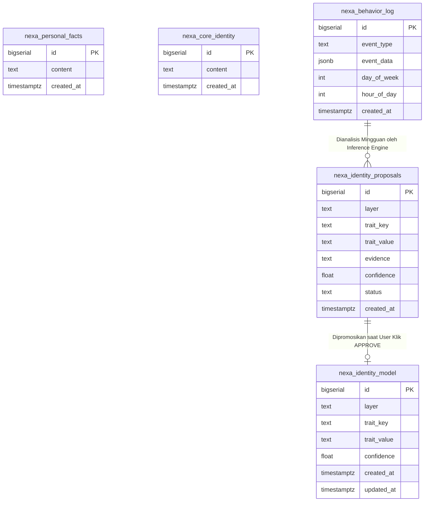
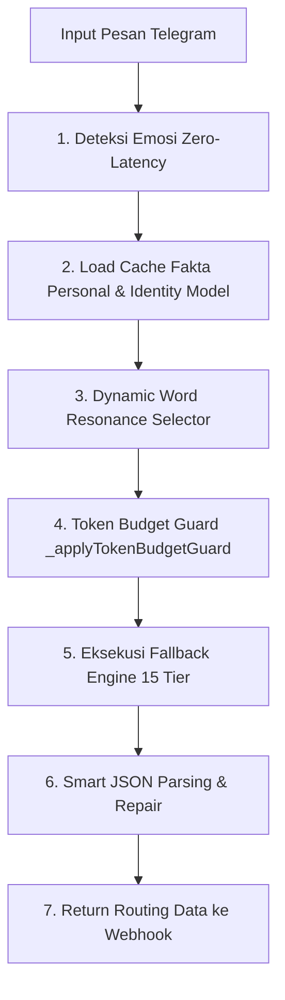
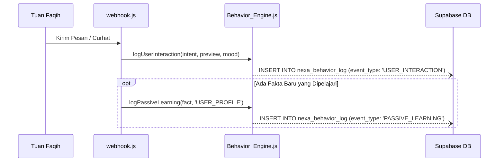
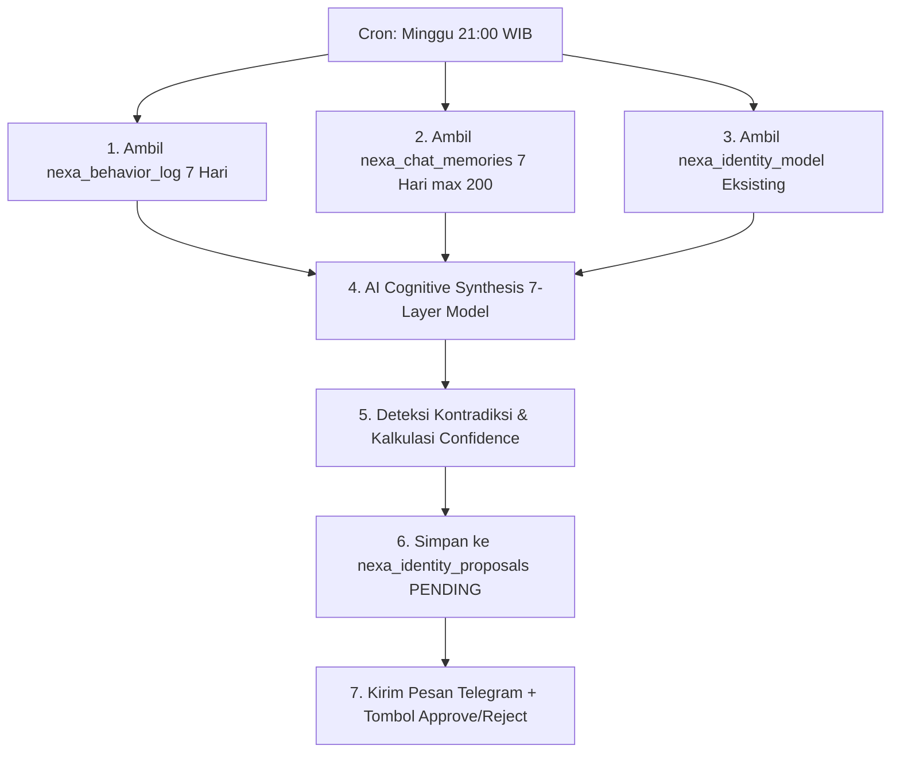
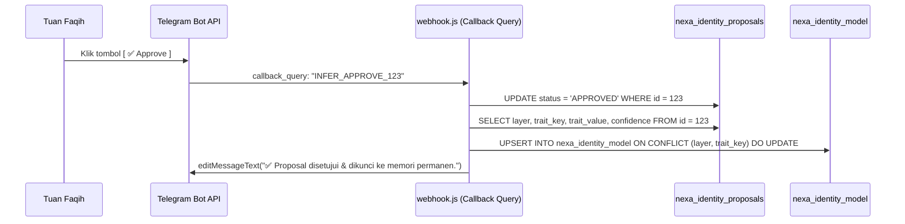

# 🧠 ARSITEKTUR TEKNIS & LOGIKA KOGNITIF MEMORI GANDA N.E.X.A (PHASE 6)

Dokumen ini adalah **referensi arsitektur teknis dan spesifikasi rekayasa (*engineering specification*)** lengkap dari Sistem Memori Ganda (*Dual-Memory System*), Mesin Pencatatan Perilaku (*Behavioral Engine*), dan Mesin Inferensi Identitas Kognitif 7-Layer (*7-Layer Cognitive Inference Engine*) N.E.X.A untuk **Tuan Faqih Hidayatulloh**.

---

## 1. Skema Database & Relasi Tabel (DDL Lengkap)

Sistem memori N.E.X.A dibangun di atas **5 tabel utama** pada PostgreSQL Supabase.



### A. Skema Tabel DDL
```sql
-- 1. Tabel Fakta Pengguna (Real-Time Passive Learning untuk Tuan Faqih)
CREATE TABLE IF NOT EXISTS "public"."nexa_personal_facts" (
  "id" BIGSERIAL PRIMARY KEY,
  "content" TEXT UNIQUE NOT NULL,
  "created_at" TIMESTAMPTZ DEFAULT NOW()
);

-- 2. Tabel Core Identity (Fakta Aturan Kepribadian & Arsitektur N.E.X.A)
CREATE TABLE IF NOT EXISTS "public"."nexa_core_identity" (
  "id" BIGSERIAL PRIMARY KEY,
  "content" TEXT UNIQUE NOT NULL,
  "created_at" TIMESTAMPTZ DEFAULT NOW()
);

-- 3. Tabel Kotak Hitam Perilaku (Behavioral Sensor Log)
CREATE TABLE IF NOT EXISTS "public"."nexa_behavior_log" (
  "id" BIGSERIAL PRIMARY KEY,
  "event_type" TEXT NOT NULL,       -- 'USER_INTERACTION', 'PASSIVE_LEARNING', 'FINANCE_RECORD', 'WAKE_UP', 'EVENING_BRIEFING_SENT'
  "event_data" JSONB DEFAULT '{}',  -- Payload kontekstual (intent, preview, mood, nominal, dll)
  "day_of_week" INT NOT NULL,       -- 0=Minggu ... 6=Sabtu (WIB)
  "hour_of_day" INT NOT NULL,       -- 0..23 (WIB)
  "created_at" TIMESTAMPTZ DEFAULT NOW()
);

-- 4. Tabel Staging Proposal Identitas Kognitif (Git-Style Pull Request)
CREATE TABLE IF NOT EXISTS "public"."nexa_identity_proposals" (
  "id" BIGSERIAL PRIMARY KEY,
  "layer" TEXT NOT NULL,            -- 'FACTS', 'PREFERENCES', 'HABITS', 'VALUES', 'DECISION_STYLE', 'WEAKNESSES', 'MOTIVATIONS'
  "trait_key" TEXT NOT NULL,
  "trait_value" TEXT NOT NULL,
  "evidence" TEXT NOT NULL,
  "confidence" FLOAT DEFAULT 0.85,
  "status" TEXT DEFAULT 'PENDING',  -- 'PENDING', 'APPROVED', 'REJECTED'
  "created_at" TIMESTAMPTZ DEFAULT NOW()
);

-- 5. Tabel Permanen Cognitive Identity Model (7-Layer Confirmed Identity)
CREATE TABLE IF NOT EXISTS "public"."nexa_identity_model" (
  "id" BIGSERIAL PRIMARY KEY,
  "layer" TEXT NOT NULL,
  "trait_key" TEXT NOT NULL,
  "trait_value" TEXT NOT NULL,
  "confidence" FLOAT DEFAULT 0.90,
  "created_at" TIMESTAMPTZ DEFAULT NOW(),
  "updated_at" TIMESTAMPTZ DEFAULT NOW(),
  CONSTRAINT "nexa_identity_model_layer_key_unique" UNIQUE ("layer", "trait_key")
);
```

---

## 2. Logika Pemrosesan Pesan & Injeksi Fakta (`AI_Router.js`)

Saat pesan masuk dari Telegram, sistem memprosesnya melalui tahapan beruntun dengan latensi minimal:



### A. Algoritma Pemilihan Fakta Selektif (*Dynamic Word Resonance*)
Sistem tidak pernah memasukkan seluruh ratusan fakta ke dalam prompt sekaligus. Fakta dipilih dengan algoritma dua lapis:

1. **Core Layer (Fondasi Tetap):**
   * Mengambil `PROFILE_CORE_COUNT = 10` fakta pertama dari `nexa_personal_facts`.
   * Mengambil `IDENTITY_CORE_COUNT = 10` fakta pertama dari `nexa_core_identity`.
2. **Resonance Layer (Relevansi Topik):**
   * Pesan user dipecah menjadi kata kunci tunggal (menghapus *stop words* umum seperti *yang, dan, untuk, di, ke*).
   * Fakta sisanya dicocokkan dengan kata kunci pesan.
   * Ambil maksimal `PROFILE_KW_LIMIT = 10` fakta profil dan `IDENTITY_KW_LIMIT = 5` fakta identitas yang relevan.

```javascript
// Total maksimal injeksi fakta per turn:
// 10 Core Profile + 10 Keyword Profile + 10 Core Identity + 5 Keyword Identity = 35 Fakta Maksimal
```

### B. Proteksi Anggaran Token (*Token Budget Guard*)
Untuk mencegah error HTTP 413 dari Groq Llama-3.3-70B (batas 12.000 TPM), sistem menerapkan `_applyTokenBudgetGuard`:

```javascript
const GROQ_CHAR_LIMIT = 42000; // ~10.500 token (dengan rasio konservatif 4 char/token)

function _applyTokenBudgetGuard(basePrompt, historyStr, systemPrompt) {
  const totalChars = basePrompt.length + historyStr.length + systemPrompt.length;
  if (totalChars <= GROQ_CHAR_LIMIT) return historyStr;

  const lines = historyStr.split('\n');
  let trimmed = lines;
  let currentTotal = totalChars;

  // Pangkas pasangan pesan tertua secara iteratif
  while (currentTotal > GROQ_CHAR_LIMIT && trimmed.length > 4) {
    const removed = trimmed.splice(0, 2);
    currentTotal -= removed.reduce((s, l) => s + l.length + 1, 0);
  }
  return trimmed.join('\n');
}
```

---

## 3. Logika Deduplikasi Fakta & Proteksi Race Condition (`deduplicateAndSaveFact`)

Ketika `AI_Router` mengidentifikasi fakta baru di field `learned_user_facts` atau `learned_core_identities`, fakta tersebut diproses melalui mekanisme pengamanan ganda:

### A. In-Flight Mutex (`_dedupInFlight`)
Mencegah dua pemanggilan paralel pada waktu bersamaan mengeksekusi operasi `INSERT` ganda:

```javascript
const _dedupInFlight = new Set();

async function deduplicateAndSaveFact(newFact, type = 'USER_PROFILE') {
  const lockKey = `${type}::${newFact}`;
  if (_dedupInFlight.has(lockKey)) {
    console.log(`[ROUTER] Deduplication: Skipped in-flight duplicate - ${newFact}`);
    return false;
  }
  _dedupInFlight.add(lockKey);
  try {
    // ... Logika AI deduplication ...
  } finally {
    _dedupInFlight.delete(lockKey); // Selalu dilepas walaupun terjadi error
  }
}
```

### B. Keputusan AI Deduplication
Hanya **40 fakta terbaru** yang dikirimkan ke model AI ringan untuk dievaluasi dengan format balasan biner/terstruktur:
* **`NEW`**: Fakta belum pernah ada → Lakukan `INSERT` baru.
* **`UPDATE [ID]`**: Fakta merupakan kelengkapan dari fakta lama nomor `[ID]` → Lakukan `DELETE` fakta nomor `[ID]`, lalu `INSERT` fakta baru.
* **`DUPLICATE`**: Fakta identik atau kurang lengkap dari yang sudah ada → Abaikan (*Drop*).

---

## 4. Anatomi Sensor Perilaku Aktif (`Behavior_Engine.js`)

Saat pesan diproses di `webhook.js`, sistem secara asinkron (*fire-and-forget*) mencatat aktivitas ke tabel `nexa_behavior_log`:



### Format Payload Khusus Per Event (`event_data`)

#### 1. Event Percakapan (`USER_INTERACTION`)
```json
{
  "event_type": "USER_INTERACTION",
  "event_data": {
    "intent": "DISCIPLINE",
    "preview": "Kadang yaahh pengen belajar bahasa Inggris tapi kadang males...",
    "mood": "NEUTRAL"
  },
  "day_of_week": 1,
  "hour_of_day": 21
}
```

#### 2. Event Pembelajaran Fakta (`PASSIVE_LEARNING`)
```json
{
  "event_type": "PASSIVE_LEARNING",
  "event_data": {
    "fact": "Tuan Faqih terkadang merasa malas untuk belajar bahasa Inggris meskipun memiliki keinginan untuk mempelajarinya.",
    "type": "USER_PROFILE"
  },
  "day_of_week": 1,
  "hour_of_day": 21
}
```

---

## 5. Logika Mesin Inferensi Mingguan (`Inference_Engine.js`)

Setiap **Hari Minggu pukul 21:00 WIB**, penjadwal `cron.js` menjalankan siklus kognitif tingkat tinggi:



### A. Algoritma Sintesis & Klasifikasi 7-Layer
AI diberikan instruksi sistemik untuk mengolah seluruh log menjadi 7 kategori:

```
[INFERENCE ENGINE SYSTEM PROMPT ENFORCEMENT]
Kamu adalah Psikolog Eksistensial & Chief Cognitive Architect N.E.X.A.
Analisis seluruh data perilaku (7 hari terakhir), riwayat obrolan, dan model eksisting.
Ekstrak DAN klasifikasikan temuan ke tepat 7 Layer:
1. FACTS          → Fakta objektif kehidupannya
2. PREFERENCES    → Preferensi berinteraksi
3. HABITS         → Ritme kebiasaan harian & jam produktif
4. VALUES         → Prinsip moral & finansial utama
5. DECISION_STYLE → Cara mengambil keputusan
6. WEAKNESSES     → Titik rawan, kelemahan, & kebiasaan menunda
7. MOTIVATIONS    → Pendorong utama & ambisi puncak
```

### B. Mekanisme Penyesuaian Skor Keyakinan (*Confidence Calibration*)
Setiap trait yang diusulkan mendapat skor `confidence` antara `0.00` hingga `1.00`:
* **`0.85 - 0.95`**: Pola muncul berulang kali (>3 kali dalam seminggu) atau didukung bukti konkret di `nexa_behavior_log`.
* **`0.70 - 0.84`**: Pola baru muncul 1-2 kali dari percakapan santai.
* **Kontradiksi dengan Model Lama**: Jika trait baru bertentangan dengan trait lama di `nexa_identity_model`, trait baru diajukan sebagai proposal pembaruan dengan melampirkan bukti pergeseran (*shift evidence*).

---

## 6. Logika Telegram Webhook Approval (`webhook.js`)

Saat Tuan Faqih menekan tombol pada pesan Telegram proposal:



### Kode Eksekusi Promosi Trait:
```javascript
// Contoh penanganan callback_query di webhook.js
if (callbackData.startsWith('INFER_APPROVE_')) {
  const proposalId = parseInt(callbackData.replace('INFER_APPROVE_', ''), 10);
  
  // 1. Ambil data proposal
  const { data: prop } = await supabase.from('nexa_identity_proposals').select('*').eq('id', proposalId).single();
  
  // 2. Upsert ke tabel permanen nexa_identity_model
  await supabase.from('nexa_identity_model').upsert({
    layer: prop.layer,
    trait_key: prop.trait_key,
    trait_value: prop.trait_value,
    confidence: prop.confidence,
    updated_at: new Date().toISOString()
  }, { onConflict: 'layer, trait_key' });

  // 3. Update status proposal
  await supabase.from('nexa_identity_proposals').update({ status: 'APPROVED' }).eq('id', proposalId);

  // 4. Reset cache agar AI langsung memanfaatkan trait baru
  aiRouter.invalidateIdentityModelCache();
}
```

---

## 7. Penanganan Teknis PostgreSQL Sequence (`setval`)

Untuk menjamin tabel tidak mengalami *crash* akibat error `23505: duplicate key value violates unique constraint "pkey"`, aturan berikut diterapkan:

1. **Setelah Reset / Truncate:**
   Selalu gunakan klausul `RESTART IDENTITY` agar `BIGSERIAL` kembali dari angka 1:
   ```sql
   TRUNCATE TABLE "public"."nexa_behavior_log" RESTART IDENTITY;
   ```
2. **Setelah Injeksi Data Manual / Seeding:**
   Wajib menjalankan sinkronisasi sequence `setval()` agar ID otomatis PostgreSQL melanjutkan dari ID tertinggi yang ada:
   ```sql
   SELECT setval(
     pg_get_serial_sequence('"public"."nexa_core_identity"', 'id'),
     (SELECT MAX(id) FROM "public"."nexa_core_identity"),
     true
   );
   ```
